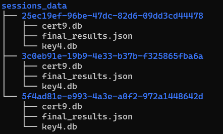

<p align="center"></p>
<p align="center"></p>

&nbsp;&nbsp;&nbsp;&nbsp;&nbsp;&nbsp;&nbsp;&nbsp;&nbsp;&nbsp;&nbsp;&nbsp;&nbsp;&nbsp;&nbsp;&nbsp;&nbsp;&nbsp;&nbsp;

[](https://travis-ci.org/tomp332/Espia_Server)

[](https://github.com/tomp332/Espia_Server/issues)

[](https://opensource.org/licenses/MIT)

# Table of contents
- [Table of contents](#table-of-contents)
- [Basic Overview](#basic_overview)
- [Setup](#setup)
  - [Local Setup](#local-setup)
  - [Docker Setup](#docker-setup)
- [Usage](#usage)
  - [Docker Usage](#docker-usage)
  - [Local Usage](#local-usage)
- [Contributors](#Contributors)
- [Contact](#contact)
- [Disclaimer](#disclaimer)


# Basic Overview

The Espia Project is a simple but usseful client server SpyWare setup. It's main goal is to gather as much information as possible from the remote machine that has been compromised.
Currently the Espia client retrieves Edge, Chrome and Firefox passwords that are stored on the PC and enables a stealthy and fast way to conduct a brief and small attak.
<div>
  
&nbsp;&nbsp;&nbsp;&nbsp;
  
  
</div>

### Espia Client
1. All retrieved products from Espia Client will be rendered and created on a local directory by their own session_id that is randomly generated.



2. final_results.json will include all retrieved data from the remote target

<br>


# Setup

Create your configuration template file using the following format:
```
[app]
SERVER_IP = 0.0.0.0
SERVER_PORT = 443
ESPIA_ENV = <prod/local>

[mailgun]
API_KEY = <Mailgun api key>
MAILGUN_DOMAIN = <Mailgun email domain>
MAILGUN_USER = <Mailgun username>
DESTINATION_EMAIL = <Destination email for results to be sent to>
```
<br><br>

###### Local Setup
1. Clone and install:
```
https://github.com/tomp332/Espia_Server.git
cd Espia_Server
pip install -r requirements.txt
```
2. Certificates are located at espia_server/certs, override them with your own if you'd like, otherwise localhost certs will run

<br><br>

###### Docker Setup

Using the docker-compose.yml file you can quickly configure your own custom server 
```
version: "3.8"

services:
        espia_server:
                container_name: espia_server
                restart: always
                image: ghcr.io/tomp332/espia-server:latest
                ports:
                        - 443:443
                volumes:
                        # Your main configuration file
                        - type: bind
                          source: <your main config.ini file>
                          target: /server/espia_server/configs/config.ini
                        # Storage for all session files that Espia receives
                        - type: bind
                          source: <path to all local session files storage>
                          target: /server/espia_server/app/uploads
                        # By default there are localhost public\private keys installed,
                        # if you want production ones override them, otherwise remove these 2 binds
                        - type: bind
                          source: <path to public key>
                          target: /server/espia_server/certs/public_key.pem
                        - type: bind
                          source: <path to private key>
                          target: /server/espia_server/certs/private_key.pem

```
<br><br>

# Usage
##### Docker Usage
After the configuration of the docker-compose.yml:
```
docker-compose up
```
#### Local Usage
1. Override the espia_server/configs/config.ini file with the one you created at the last step, and you're all set
```
python3 -m espia_server
```

# Espia Client
#### Routes

# Product Example

# Contributors
 - @dvbergmann [David Bergmann](https://github.com/dvbergmann)
<br><br>

# Contact

Feel free to open issues and contact us with any question :+1:

- :email: [tomp12@protonmail.com](mailto:tomp12@protonmail.com)

- :globe_with_meridians: [Twitter](https://twitter.com/tomp332)

- :octocat:  [Github](https://github.com/tomp332)
<br><br>

# Disclaimer

You shall not misuse the information to gain unauthorised access. However you may try out these hacks on your own computer at your own risk. Performing hack attempts (without permission) on computers that you do not own is illegal.

Enjoy :metal:
